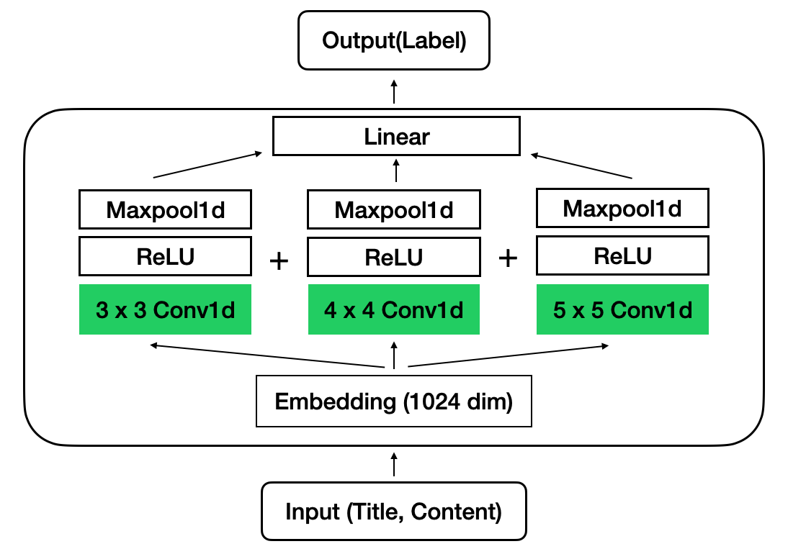
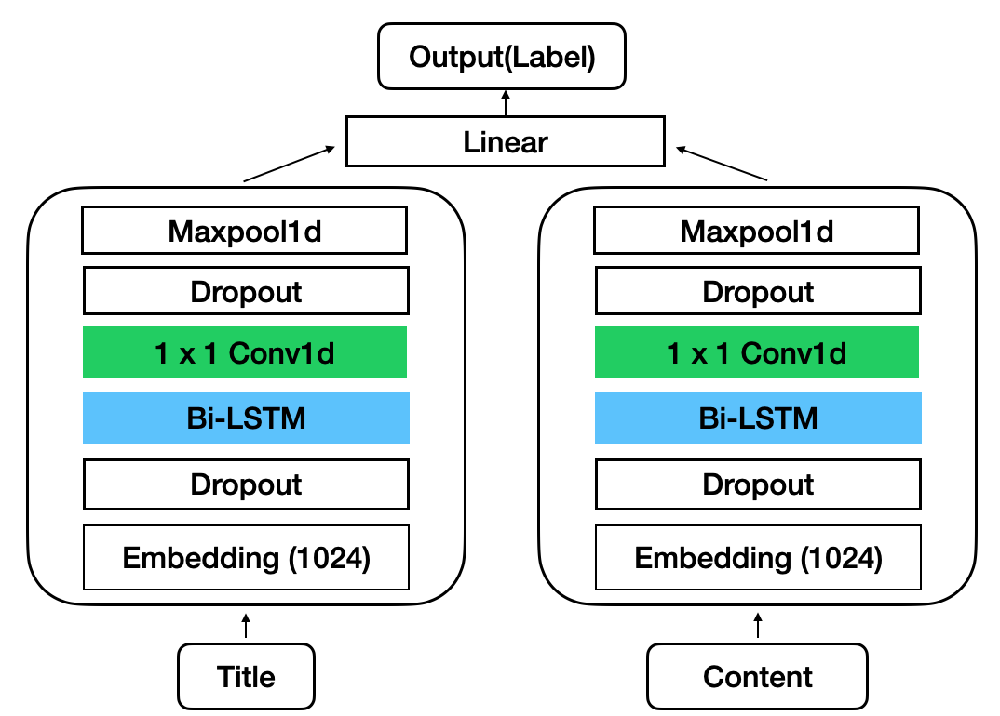
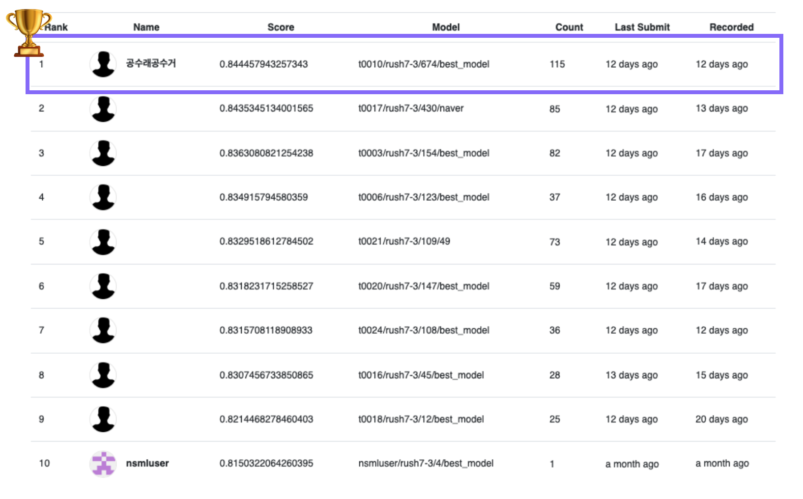

# 0. AI RUSH란?

Naver에서 기획한 [AI 프로젝트 챌린지](https://campaign.naver.com/airush/)로 2020년 7월 13일부터 8월 27일까지 진행되었다. 서류 심사 그리고 코딩테스트를 거쳐야 본격적인 AI 과제에 참여할 수 있었다. AI 과제는 1차, 2차로 나누어 진행됐다. 1차는 NLP와 Vision 과제가 하나씩 나왔는데, 각 과제 상위 25명만 2차에 진출할 수 있었다. 2차 과제는 NLP와 Vision 뿐만아니라 Speech, Anomaly detection 등 다양한 주제로 구성되어있었다. 필자는 1차에서 NLP 과제를 수행했는데 운 좋게도 2라운드에 진출하였고, 2차에서 *공수래공수거* 라는 팀이름으로 Grammatical error correction와 Spam mail classification 두 가지 과제에 참여했다. 결국 최종 결과로 **GEC 과제에서 3등**, **Spam 과제에서 1등**을 기록했다. 이 포스팅에서는 정신 없이 앞만 보고 달려온 한달 남짓을 되돌아보면서 우리가 SPAM 과제에 어떻게 접근했는지를 최대한 가감없이 정리해보려고 한다. 

# 1. 스팸 메일 분류

메일의 제목과 본문을 보고 스팸 여부를 판정하는 과제이다. 학습 데이터는 총 `131,880`개로, 이 중 `7,310`개가 스팸 메일이었다. 메일은 제목과 본문이 구분 되어있는 형태였으며 아래와 같이 네이버에서 사용하는 토크나이저에 의해서 숫자로 인코딩되어있었다. 제목과 본문은 <TAB>키로 구분되어 있었고 데이터를 관찰한 결과 '6981'이 온점, '0'이 <UNK>라는 것도 알 수 있었다. 그리고 각 데이터마다 0(ham) 또는 1(spam)로 구분된 정답 label이 있었다. 

평가는 F1 score 통해서 진행되었다. 기본적으로 주어진 Baseline의 성능은 Validation이 `0.937`, Test가 `0.815`이였다. 본문이 각각 GRU를 통과하고 마지막에 Linear layer를 거쳐서 예측을 하는 아주 간단한 구조의 모델이었다. 매주 새로운 Test set에 대해서 평가가 진행되었고, 우리는 약 3주에 걸쳐서 이 성능을 최대한으로 끌어내야 했다. 결국 최종 제출 당시 Validation은 `0.974`, Test는 `0.8445` 를 기록하면서 1등으로 대회를 마무리했다. 

# 2. 계획 세우기

시간이 무한정 주어지지 않았으므로 해볼 수 있는 것들의 우선순위를 정해야 했다. 우리 팀이 생각했을 때 꼭 해야할 것들은 다음과 같았다. 

- Baseline code
  - 기본적으로 주어진 Baseline 코드가 어떻게 짜여있는지, 코드에 오류는 없는지 확인한다. 
- Data Augmentation
  - 데이터를 추가로 확보할 수 는 없는 상황이므로, 기존의 데이터에 Noise를 추가하는 등 데이터를 augment 해서 사용할 수 있는 방법을 적용해본다. 
- Modeling
  - 기존에 구현되어있는 GRU기반 Baseline 이외에 다양한 모델들을 적용하여 실험해본다. 
- Ensemble ⚡️
  - Competition 가장 중요하다고도 할 수 있는 모델 앙상블을 NSML 환경에 적용할 수 있도록 구현한다. 
- Hyperparamter Tuning
  - 남는 시간과 GPU를 효율적으로 활용해서 최대한 기존 성능을 끌어올릴 수 있는 파라미터를 찾는다. 

결론적으로 말하면 성능 향상에 가장 도움이 되었던 것은  **Modeling - Ensemble - Hyperparamter Tuning - Baseline Code - Data Augmentation** 였고, 아래부터는 이 순서대로 어떻게 프로젝트를 진행했는지 하나씩 살펴보도록 하겠다. 

# 3. Modeling 

> 최대한 다양한 모델을 실험해본다.

우선 본 Task는 이미 데이터가 Tokenizing을 거친 형태로 주어졌기 때문에 BERT를 비롯한 Pre-trained 모델을 사용할 수 없었다. 이 부분이 사실 가장 큰 obstacle이었는데, NLP의 최근 2년간 기술 발전은 대부분 Pre-training을 사용하는 것에서부터 시작한다고 해도 과언이 아니기 때문이다. 따라서 우리 팀은 스팸 메일 분류에 적합한 모델을 찾기 위해서 Text Classification[^1] 에 사용되는 모델들을 찾아보기 시작했다. Bi-LSTM부터 시작해서 Transformer Encoder 모델까지 한번이라도 들어본 모델은 전부 구현해서 실험해보았다. 구현하여 실험한 모델 중 가장 성능이 좋았고 실제로 제출에 사용된 모델의 구조와 코드를 적어보았다. 전체 코드는 [Github Repository](https://github.com/boychaboy/NAVER-AI-RUSH-2020-SPAM)를 참고하기 바란다.  

## TextCNN ⭐️

- Yoon Kim 저자의 [Convolutional Neural Networks for Sentence Classification](https://arxiv.org/abs/1408.5882) 논문에서 제안된 모델
- 학습도 빠르고 성능도 가장 좋았다. 스팸 메일 분류에 가장 적합한 모델인 것으로 보인다. 



class TextCNN(nn.Module):
    def __init__(self, args):
        super(TextCNN, self).__init__()
        self.args = args
        self.embeddings = nn.Embedding(args.vocab_size, args.embedding_dim)
        self.conv1 = nn.Sequential(
            nn.Conv1d(in_channels=args.embedding_dim, out_channels=args.num_channels, kernel_size=args.kernel_size[0]),
            nn.ReLU(),
            nn.MaxPool1d(args.max_title + args.max_content - args.kernel_size[0]+1)
        )
        self.conv2 = nn.Sequential(
            nn.Conv1d(in_channels=args.embedding_dim, out_channels=args.num_channels, kernel_size=args.kernel_size[1]),
            nn.ReLU(),
            nn.MaxPool1d(args.max_title + args.max_content - args.kernel_size[1]+1)
        )
        self.conv3 = nn.Sequential(
            nn.Conv1d(in_channels=args.embedding_dim, out_channels=args.num_channels, kernel_size=args.kernel_size[2]),
            nn.ReLU(),
            nn.MaxPool1d(args.max_title + args.max_content - args.kernel_size[2]+1)
        )
        self.dropout = nn.Dropout(args.dropout)
        self.fc = nn.Linear(args.num_channels*len(args.kernel_size), 1)
        self.sigmoid = nn.Sigmoid()
        
    def forward(self, title, content):
        x = torch.cat((title, content), 1).transpose(0,1)

​        embedded_sent = self.embeddings(x).permute(1,2,0)
​        embedded_sent = self.dropout(embedded_sent)

​        conv_out1 = self.conv1(embedded_sent).squeeze(2)
​        conv_out2 = self.conv2(embedded_sent).squeeze(2)
​        conv_out3 = self.conv3(embedded_sent).squeeze(2)
​        
​        all_out = torch.cat((conv_out1, conv_out2, conv_out3), 1)
​        final_feature_map = self.dropout(all_out)
​        final_out = self.fc(final_feature_map)
​        return self.sigmoid(final_out)



## Bi-LSTM + CNN

- Kaggle competition 중 하나인 [Quora Insincere Question Classification](https://www.kaggle.com/c/quora-insincere-questions-classification/overview) 에서 [1등 팀 게시물](https://www.kaggle.com/c/quora-insincere-questions-classification/discussion/80568)의 Architecture를 참고했다. 
- 학습은 느린 편이었지만 TextCNN에 준하는 성능을 보였다. 



class LSTM_CNN(nn.Module):
    def __init__(self, args):
        super().__init__()

​        self.vocab_size = args.vocab_size
​        self.embedding_dim = args.embedding_dim
​        self.hidden_dim = args.hidden_dim
​        self.dense = args.dense
​        self.layers = args.layers
​        self.dropout_rate = args.dropout
​        self.filter_size = 1

​        self.embedding = nn.Embedding(self.vocab_size, self.embedding_dim, padding_idx=0)
​        self.bilstm = nn.LSTM(self.embedding_dim, int(self.hidden_dim/2), batch_first=True, bidirectional=True)
​        self.conv1_title = nn.Sequential(
​            nn.Conv1d(in_channels=args.hidden_dim, out_channels=args.num_channels, kernel_size=1),
​            nn.ReLU(),
​            nn.MaxPool1d(args.max_title - 1+1)
​        )
​        self.conv1_content = nn.Sequential(
​                nn.Conv1d(in_channels=args.hidden_dim, out_channels=args.num_channels, kernel_size=1),
​            nn.ReLU(),
​            nn.MaxPool1d(args.max_content - 1+1)
​        )

​        self.linear1 = nn.Linear(args.num_channels * 2, self.dense)
​        self.linear2= nn.Linear(self.dense, 1)
​        self.sigmoid = nn.Sigmoid()
​        self.dropout = nn.Dropout(self.dropout_rate)
​        self.norm = nn.BatchNorm1d(self.dense)

​        self.softmax = nn.Softmax(dim=1)

​    def forward(self, title, content):
​        title = self.embedding(title)
​        content = self.embedding(content)

​        title = self.dropout(title)
​        content = self.dropout(content)

​        title, _ = self.bilstm(title)
​        content, _ = self.bilstm(content)

​        title = self.conv1_title(title.transpose(1,2)).squeeze(2)
​        content = self.conv1_content(content.transpose(1,2)).squeeze(2)
​        
​        x = torch.cat((title, content), 1)
​        x = self.linear1(x)
​        
​        x = self.dropout(x)
​        x = self.norm(x)
​        
​        x = self.linear2(x)
​        x = self.sigmoid(x)
​        
​        return x



# 4. Ensemble

> 결국 앙상블이 다 했다. 

앙상블을 구현하는 방법에는 여러가지가 있다. 

1. 여러 모델이 동시에 **역전파**가 일어나도록 하나의 큰 모델을 학습시키는 앙상블
2. 각 모델을 통해서 나온 prediction score를 더하여서 최종 prediction score를 계산하는 앙상블
3. 각 모델을 예측하도록 한 다음 그 결과를 vote시켜서 최종 답을 결정하는 앙상블

우리 팀은 다양한 실험을 위해서 위의 세 가지 방법 모두를 실험해보았고, 결론적으로 **2번** 방법이 가장 좋은 성능을 내는 것을 확인하였다. 

그 다음에는 **다양한 모델** 을 조합하여 어떤 것이 가장 높은 성능을 거두는지를 실험해보았고, 그 결과 7개의 모델을 조합한 앙상블이 가장 성능이 높았다. 앙상블을 해보면서 얻은 결론은 **최대한 다양하고** **서로 다른 데이터로 학습된 모델** 을 앙상블 하는 것이 좋다는 것이다. 

# 5. Tuning

>  튜닝은 결국 나 자신과의 싸움이다. 

무슨말이냐면 결국에 더 많이, 더 오래, 더 잘 정리하면서 튜닝한 사람이 승자라는 것이다. 사실 튜닝하는 과정은 그렇게 재미있지 않기 때문에 끈기가 필요하다. "이 정도면 되겠지"라는 생각으로 멈추고 싶을 때가 많고, "더 오르겠어?"라는 생각이 들 때 쯤 거짓말같이 성능이 더 오르기도 하는게 바로 파라미터 튜닝이다. 

이번 대회를 진행하면서 팀원으로부터 튜닝을 할 수 있는 좋은 방법을 한가지 배워서 적용하였고, 본 포스팅에서 이를 소개하려고 한다. 바로 **쉘 스크립트 작성**이다. 

방법은 간단하다. 아래 예시를 보자. 


#!/bin/bash

model=$1
num=$2
timestamp=$(date +%m/%d-%H:%M:%S)

lr=(0.0001 0.0002 0.0005)
embedding_dim=(256 512 1024)
dropout=(0.2 0.3 0.4)
pooling=("mean" "sum" "max" "mean_max")

for i in $(seq 0 $num); do
    lr=${lr[$(( $RANDOM % ${#lr[@]} ))]}
    embedding_dim=${embedding_dim[$(( $RANDOM % ${#embedding_dim[@]} ))]}
    dropout=${dropout[$(( $RANDOM % ${#dropout[@]} ))]}
    pooling=${pooling[$(( $RANDOM % ${#pooling[@]} ))]}

    echo "-------------------- $i : $timestamp --------------------"
    echo "lr : $lr"
    echo "embedding_dim : $embedding_dim"
    echo "dropout : $dropout"
    echo "pooling : $pooling"
    echo ""

    nsml run -g 1 -d rush7-2 -a "\
	--batch_size 256 \
	--model $model
	--lr $lr \
	--embedding_dim $embedding_dim \
	--dropout $dropout \
	--pooling $pooling \
	"
    sleep 60m

    done


위와 같은 스크립트를 실행해놓으면 알아서 `$model` 종류에 따라서 `$num` 갯수만큼 랜덤한 파라미터로 실험을 진행한다. 본 대회는 nsml[^2] 환경에서 실험을 진행하였기 때문에 실험이 돌아가는 시간만큼 sleep을 해주면 해당 시간을 기다렸다가 알아서 다음 실험을 돌린다. 필자는 하나의 모델을 구현할 때마다 이 쉘 스크립트를 사용해서 20개정도의 랜덤 파라미터로 모델을 실험해보고 성능이 좋지 않다 싶으면 바로 다음 모델로 넘어갔다. 이 랜덤 쉘 스크립트의 최대 장점은 **파라미터를 어떻게 바꿀지 고민하지 않아도 된다** 는 것이다. 또한 실험이 언제 끝나는지 일일이 확인하지 않아도 되기 때문에 실험을 돌려놓은 다음에는 이를 **완전히 잊은 채로 다른 일에 집중할 수 있다**. 실제로 그렇게 여러 모델을 구현하고 실험하고를 반복했고, 따라서 작업 효율을 극대화시킬 수 있었다. 

# 6. Baseline Code

첫 날, 대회가 시작하자마자 Baseline 코드 분석부터 시작했다. 먼저 기존 세팅 그대로 학습을 돌려서 제출해보았다. 1라운드에서 Baseline 코드의 버그만 고쳐서 돌려도 성능이 올라갔었기 때문에  혹시 이번 코드에도 사소한 버그가 있는지 확인했다. 아주 사소하지만 `dataset.py`에 padding을 하는 부분에서 `title`과 `content` 를 padding하는 길이를 설정해주는 부분에 오타가 있었다. 이 부분을 고쳐주자 미세하게 성능이 향상되었다. 사실 문제를 출제하는 사람들의 실수를 할 수 있기 때문에 앞으로 다른 대회에서도 맨 처음 주어진 baseline 코드를 먼저 꼼꼼히 확인하는 것도 좋은 습관이라도 생각한다. 

# 7. Data Augmentation

사실 딥러닝에서 성능 변화에 가장 큰 영향을 주는 것은 **데이터** 이다. 따라서 우리도 데이터를 건드려보지 않을 수 없었는데, 이미 숫자로 인코딩되어 주어졌기 때문에 데이터를 건드리는 것이 쉽지는 않았다. **기존의 데이터를 Augment해서 학습시키는 방법** 과 **Data Imbalance를 해결하는 방법** 두 가지의 방향으로 문제를 해결하려고 했고, 고민 끝에 우리가 시도해본 방법은 다음과 같다. 

### Data Imbalance

- Weighted Sampler ⭐️
  - 가장 효과가 좋았던 방법이다.
  - Batch마다 Spam과 Ham이 1:1비율로 학습되도록, 더 적은 비율의 데이터에 Weight를 주어서 학습하는 방법이다. 
  - Pytorch에는 따로 구현된 모듈이 없어서 구글링을 통해 해당 [pytorch discussion page](https://discuss.pytorch.org/t/balanced-sampling-between-classes-with-torchvision-dataloader/2703/8) 를 참고하여 `Weigthed Sampler` 를 구현하였다. (혹시 코드가 필요하신 분은 프로젝트 [GitHub](https://github.com/boychaboy/NAVER-AI-RUSH-2020-SPAM)를 참고하세요 )
- Validation data distribution 
  - Test data의 distribution이 1:1일 것이라는 예상으로 출발하였다. 
  - 실제로 Validation data의 분포를 1:1로 맞추어서 평가하니 Validation Accuracy와 Test Accuracy가 비례하여 측정되었다. 

### Data Augment

- Remove <UNK>
  - 기존 데이터 + <UNK>를 제거한 데이터로 데이터를 두배해서 학습시켰다. 
  - 성능이 오히려 떨어졌다 👎
- Double Data(Title + Content & Content + Title)
  - 기존 데이터는 제목 + 본문 형태인데, 이것과 본문 + 제목으로 순서를 바꾼 데이터를 더하여 데이터를 두배해서 학습시켰다. 
  - 성능은 그대로였고 수렴만 두 배로 빨라졌다 : **단순히 데이터를 두번 본 효과가 났다**. 

# 8. 마치며...

대회 마지막날까지 조마조마했지만 다행히도 결과는 1등이었다. 3주 가량 동안 대회를 진행하면서 잘 했던 것과 아쉬웠던 것을 정리해보았다. 

### 잘 한 것

지나고 보니 역시 **NSML에서 돌아가는 앙상블 코드**[^3] 를 미리 첫 주차에 작성했던 것이 현명한 선택이었다. 앙상블을 하면 성능이 오를 것이라는 믿음 덕분에 2주차까지 여유롭게 다양한 모델로 실험을 할 수 있었기 때문이다. 두번째로 Hyperparameter Fine-tuning을 쉽게 할 수 있는 **스크립트를 작성했던 것** 도 시간 절약에 큰 도움이 되었다. **Notion** 툴을 사용해서 팀원과 협업하고 프로젝트 진행 과정과 실험 결과를 쉽게 공유한 것도 좋았다. 

### 아쉬웠던 것

- 실험 결과를 자동으로 기록하고 정리하는 템플릿을 쓰지 못한 것
  - **Tensorboard** 와 같은 툴을 활용하면 내가 돌린 실험 결과를 자동으로 기록하고 분류해주는데, NSML에 기본적으로 기록해주는 기능이 있어서 이를 구현하지 않았다. 하지만 NSML 웹으로 실험 결과를 분석하기에는 역부족이었고 결국 일일이 노션에 표를 만들어서 기록하게 되었다. 물론 기록하는 과정에서 한 번 더 정리할 수 있어서 좋았지만, 실험 결과가 쌓일 수록 기록을 안하고 머릿속에 기억하려고 하는 내 자신을 발견하였다~~(너어어무 귀찮더라)~~. 다음에는 시간을 꽤 투자하더라도 대회 초반에 실험 결과 기록 자동화를 꼭 구현해야겠다. 
- 데이터를 Caching 하지 않은 것
  - NSML을 쓰는 것이 아니라면 데이터를 Tensor로 변환해서 Caching해놓는 코드를 꼭 구현해야겠다. **매번 실험을 돌릴 때마다 dataload를 하는 데에 걸리는 시간이 티끌같지만 모이면 태산이다.** 

사실 가장 잘 한 일은 본 대회에 출전한 것이다. 이렇게까지 좋은 결과를 얻게될 줄은 생각 못했는데, 정말 유익하고 보람찬 대회였다. 혹시 이듬 해 대회 출전을 고민중인 독자가 있다면 꼭 출전할 것을 추천하는 바이다.

[^1]: 텍스트 분류(Text Classification)는 텍스트를 입력으로 받아, 텍스트가 어떤 종류의 범주(Class)에 속하는지를 구분하는 작업을 구합니다. 가령, 여러분이 스팸 메일 분류를 하고자 한다고 합시다. 스팸 메일 분류는 일반 메일과 스팸 메일이라는 두 개의 범주를 정해놓고 입력받은 텍스트를 두 개의 클래스 중 하나로 분류하는 작업이 될 것입니다.
[^2]: NSML은 네이버가 개발한 연구에 불필요한 작업들을 제거하고, GPU 자원의 효율적인 사용을 위해 개발된 MLaaS (Machine Learning as a Service), 클라우드 플랫폼입니다. 자세한 내용은 [NSML Documentation](https://n-clair.github.io/vision-docs/_build/html/ko_KR/index.html) 을 참고하세요. 
[^3]: 해당 코드는 [GitHub Repository](https://github.com/boychaboy/NAVER-AI-RUSH-2020-SPAM) 에 구현되어 있습니다. 필요하신 분은 참고하세요. 
